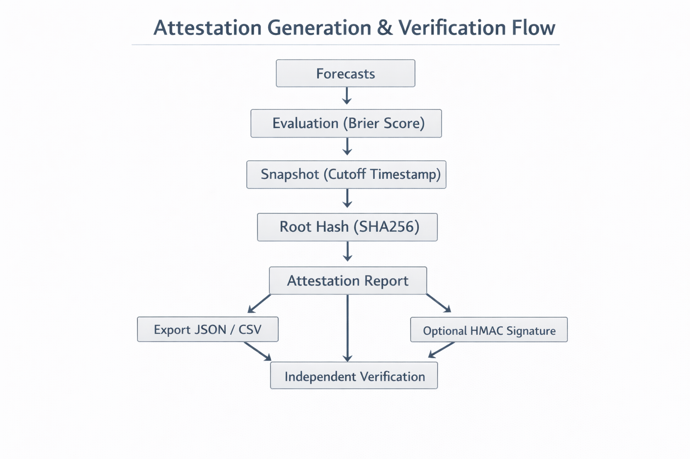

# Sigmodx

Sigmodx is the reference scoreboard for probabilistic forecasts.

It provides deterministic evaluation, cryptographic snapshot integrity,
and regulator-grade attestation infrastructure for both public and institutional use.

## Overview

Sigmodx implements a deterministic benchmark engine that evaluates probabilistic forecasts against macro and financial data sourced exclusively from official APIs. The system employs a frozen Brier Score v1.0 methodology to ensure consistent, reproducible evaluation across all forecasts.

The platform maintains append-only evaluation snapshots with SHA256 root hash integrity verification, enabling independent verification of all evaluation results. Each snapshot is cryptographically signed and immutable, providing audit-grade traceability.

Sigmodx operates in two distinct modes:

**Public AI Evaluation Protocol (AIEP)**: An open evaluation framework for AI models and forecasting systems. The protocol maintains a public model registry, processes evaluation batches deterministically, and generates exportable artifacts with verifiable hashes. Optional HMAC signing provides additional integrity guarantees for public submissions.

**Institutional Mode**: A parallel evaluation infrastructure designed for private organizational use. Organizations maintain isolated forecast tables with snapshot cutoff enforcement and forecast locking mechanisms. The system generates signed attestations and provides reproducibility endpoints for independent verification. All institutional operations are recorded in an append-only audit log.

## Architecture

Sigmodx is structured as a layered, deterministic evaluation system with strict institutional isolation and cryptographic integrity guarantees.

### 1. System Architecture

This diagram illustrates the layered system structure:
- Frontend (Next.js)
- Backend API (FastAPI)
- Benchmark & Scoring Engines
- Snapshot Integrity Layer
- Institutional Mode
- AIEP & PMAL
- Supabase (Postgres + RLS)
- Redis (cache + queue)

### 2. Institutional Mode Isolation

Institutional Mode operates in a parallel infrastructure rail.
Organization forecasts, snapshots, attestations, and audit logs
are strictly isolated from public tables.
No cross-writes are permitted.

### 3. Attestation & Verification Flow

Forecasts → Evaluation → Snapshot → Root Hash → Deterministic Report → Optional HMAC → Independent Verification.

## System Architecture

Sigmodx implements a layered architecture that separates data ingestion, evaluation, integrity verification, and institutional workflows.

### 1. Benchmark Ingestion Layer

The benchmark ingestion layer sources deterministic data from official APIs including FRED (Federal Reserve Economic Data) and Stooq. Data generation and resolution are idempotent, ensuring consistent benchmark values across all evaluations regardless of ingestion timing or order.

### 2. Scoring Engine

The scoring engine implements Brier Score v1.0 as a frozen methodology. The versioning system ensures that evaluations remain comparable across time periods and that methodology changes are explicitly versioned and documented. The system computes percentile rankings relative to historical forecast performance, providing context for individual forecast scores.

### 3. Snapshot Integrity Layer

The snapshot integrity layer maintains cryptographic guarantees for all evaluation results. Each entity-level snapshot includes a SHA256 hash of its contents. Dataset-level snapshots compute a root hash from all constituent entity hashes. All snapshot records are append-only, preventing retroactive modification of evaluation history.

### 4. Institutional Mode

Institutional Mode provides a parallel infrastructure for organizational use. Organizations operate in isolated environments with private forecast tables. Snapshot cutoff timestamps enforce temporal boundaries for evaluation windows. Forecast locking prevents modification after submission deadlines. The system generates signed attestations for completed evaluations and provides reproducibility endpoints that allow independent verification of evaluation results. All operations are recorded in an append-only audit log.

### 5. Public Evaluation Layer (AIEP)

The Public AI Evaluation Protocol maintains a model registry for public submissions. Evaluation batches are processed deterministically, ensuring consistent results across runs. The system generates exportable artifacts with deterministic export hashes, enabling verification of exported data integrity. Optional HMAC signing provides additional authentication for public submissions.

### 6. Prediction Market Accountability Layer (PMAL)

The Prediction Market Accountability Layer ingests external market data and performs independent resolution against benchmark sources. Reconciliation hashing ensures that market resolutions match official benchmark values. The system computes a platform integrity index that measures alignment between market predictions and benchmark outcomes. All reconciliation data is recorded in a public ledger.

## Cryptographic Guarantees

Sigmodx enforces cryptographic guarantees through deterministic serialization, hashing, and optional signing mechanisms.

**Deterministic JSON Serialization**: All data structures are serialized using deterministic JSON rules, ensuring that identical data produces identical byte sequences regardless of serialization order or system differences.

**SHA256 Hashing**: Entity-level snapshots and dataset-level root hashes use SHA256 for integrity verification. The hierarchical hashing structure enables efficient verification of individual snapshots and entire datasets.

**Optional HMAC Signing**: Public submissions may include HMAC signatures for authentication and integrity verification beyond the base cryptographic guarantees.

**Snapshot Cutoff Timestamps**: Each snapshot includes a cutoff timestamp that defines the evaluation window boundary. Forecasts submitted after the cutoff are excluded from that snapshot, ensuring temporal consistency.

**Append-Only Enforcement**: The system enforces append-only semantics at the database and application layers, preventing modification or deletion of historical snapshots.

**Reproducibility Endpoints**: Institutional Mode provides endpoints that allow independent reproduction of evaluation results. These endpoints accept snapshot identifiers and return deterministic evaluation outputs with verifiable hashes.

## Institutional Workflow

Institutional users follow a six-step workflow for forecast evaluation and attestation:

1. **Create Organization**: Establish an institutional account with isolated infrastructure and private forecast tables.

2. **Submit Forecasts**: Submit probabilistic forecasts through the institutional API. Forecasts are associated with benchmark identifiers and submission timestamps.

3. **Run Deterministic Evaluation**: Trigger evaluation against benchmark data. The system computes Brier Scores using the frozen v1.0 methodology and generates percentile rankings.

4. **Generate Attestation**: Upon completion of evaluation, the system generates a signed attestation document. The attestation includes snapshot hashes, evaluation metadata, and cryptographic signatures.

5. **Export JSON/CSV**: Export evaluation results in JSON or CSV formats. Exported files include deterministic hashes that enable verification of export integrity.

6. **Independently Verify Report Hash**: Use the reproducibility endpoint or manual hash computation to verify that exported reports match the system-generated attestation hashes.

## Technology Stack

**Frontend**:
- Next.js (App Router)
- React
- Tailwind CSS

**Backend**:
- FastAPI
- Supabase (PostgreSQL with Row Level Security)
- Redis (caching and task queue)
- RQ worker (asynchronous task processing)

**Deployment**:
- Vercel (frontend)
- Railway (backend infrastructure)

## Design Principles

Sigmodx adheres to five core design principles:

**Deterministic Evaluation Only**: All evaluations produce identical results when given identical inputs, regardless of execution timing or system state. This ensures reproducibility and comparability across time periods.

**Frozen Methodology Versioning**: Evaluation methodologies are versioned and frozen. Changes to scoring algorithms require new version numbers and explicit documentation. This prevents silent changes that would invalidate historical comparisons.

**Append-Only Governance**: Historical data cannot be modified or deleted. All changes are additive, creating an immutable audit trail. This principle applies to snapshots, forecasts, and audit logs.

**Parallel Institutional Isolation**: Institutional Mode operates in complete isolation from public evaluation. Organizations cannot access other organizations' data, and public evaluations cannot access institutional data. This ensures privacy and regulatory compliance.

**Cryptographic Reproducibility**: All evaluation results can be independently verified through cryptographic hashes and reproducibility endpoints. Third parties can verify the integrity and correctness of any evaluation without relying on Sigmodx infrastructure.

## License

[License information to be added]
